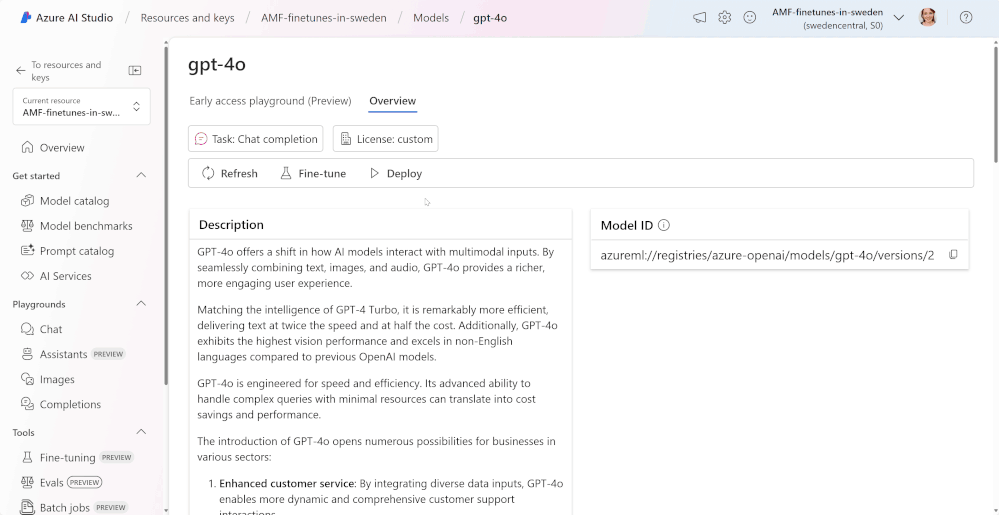

# Azure gpt-4o AnyLang

Fine tuning Azure gpt-4o model understand and answer in a new language using Python and Azure AI Studio

## ✅ Prerequisites

- Azure subscription
- Cloud Translate API keys
- That the language is supported in Google Translator

## 🗂️ Folder and Files Composition

### `csv_handling`: Scripts to handle csv files

- `create_csv.py`: Create the CSV file out of the Alpaca JSON 
- `csv2jsonl.py`: Convert the translated CSV to a JSONL file, ready to be finetuned in Azure
- `csv2language.py`: Translate the CSV to the new language 

### `data`: Where the CSV files are gonna be located
- `xxx.txt`: Don't mind it, just there for uploading the data folder to GitHub

### `examples`: Some example scripts (not really necessary)
- `csv2HF.py`: Upload the translated CSV file into HuggingFace 
- `test_translate`: Script to test the Cloud Translate API credentials

### `jsons`: Where the JSON files are gonna be stored
- `alpaca_data_cleaned.json`: The Alpaca JSON dataset (already cleaned btw) 

### `keys`: Where the JSON credential of Cloud Translate is gonna be stored
- `xxx.txt`: Just there for uploading the keys folder to GitHub

### `preliminaries`: Some preliminaries checks to use finetune using Azure models
- `preliminary_check.py`: Check the Training and Validation JSONL files
- `validate_tokens.py`: Estimate the Azure token counts used for the finetuning

### `finetune.py`: Upload the finetuning files to Azure platform

## ⚙️ Configuration Steps

1. Get a Cloud Translate API JSON Auth. key. Check how [here](https://docs.aicontentlabs.com/articles/google-translate-credentials/). 
>[!NOTE]
> Follow until you get the JSON file

2. Place the JSON file inside `keys` folder

3. Create a `.env` file with these Azure values: 

        AZURE_OPENAI_ENDPOINT=
        AZURE_OPENAI_API_KEY=
        AZURE_API_VERSION=

4. Install all the requirements:

        pip install -r requirements.txt

## 🧑‍💻 Steps 2 Follow
1. Go to the `csv_handling` folder an run the `create_csv.py`

2. Edit the `csv2language.py`

    - Change the `TARGET_LANGUAGE_CODE` (ln.7) for the one of the language you want. Check the codes [here](https://cloud.google.com/translate/docs/languages)

            TARGET_LANGUAGE_CODE = 'qu'

    - Place your Cloud Translate API Auth. JSON Path in ln.14

            os.environ["GOOGLE_APPLICATION_CREDENTIALS"] = "/Your/path/to/keys.json"

3. Run the `csv2language.py` file. This might take some time. 

>[!NOTE]
> You'll find the CSV files in the `data` folder

4. Run the `csv2jsonl.py` file. You will find the JSONL files in the `jsons` folder

5. Once the JSONL files are done, go to `preliminaries` folder, run both files. (First the `preliminary_check.py` file)

6. Go to the main directory, run the `finetune.py`. 

7. Last but not least, go to your Azure AI Studio and follow [these guidance](https://techcommunity.microsoft.com/t5/ai-azure-ai-services-blog/fine-tune-gpt-4o-on-azure-openai-service/ba-p/4228693)

    

>[!NOTE]
> As Training Data select the `training_set.jsonl` and as Validation Data `validation_set.jsonl`. They should be uploaded to Azure AI Studio for you to choose.

## 📚 References
- [Microsoft Documentation](https://learn.microsoft.com/en-us/azure/ai-services/openai/tutorials/fine-tune?tabs=python-new%2Ccommand-line)
- [Fine Tune GPT-4o model](https://techcommunity.microsoft.com/t5/ai-azure-ai-services-blog/fine-tune-gpt-4o-on-azure-openai-service/ba-p/4228693)